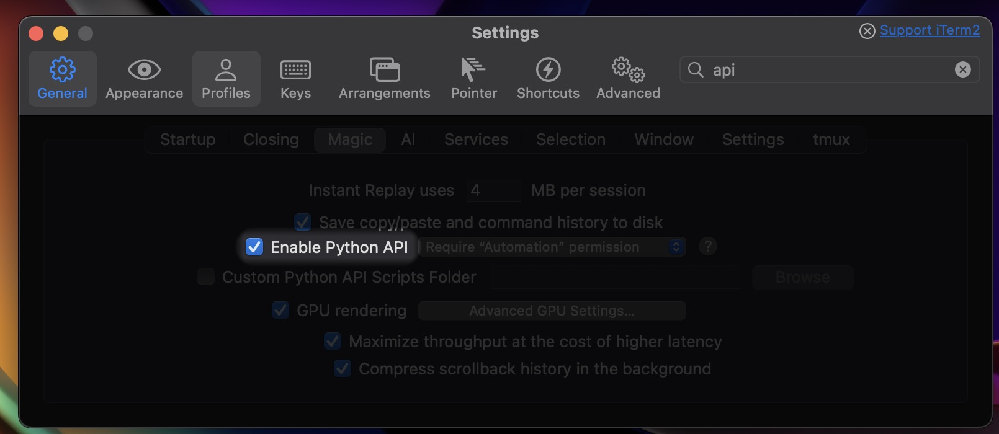
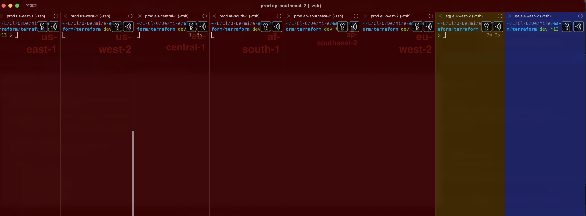

## Usage
https://youtu.be/rYSePf9fJio  
These scripts are used together where `./quick-ops` acts as an entrypoint.  
This allows to save time on running commands in multi-environment setup by running them simultaneously, while saves you from messing up tabs/environments (applying things to a wrong target).

This feels like ansible ad-hoc commands but with enhanced user experience because you can toggle broadcast input, view fresh logs in related tabs.

## Installation
Add `./quick-ops`, `./safe-ops`, `./update-kubeconfigs` script to your PATH. 
```sh
mkdir ~/scripts
echo 'export PATH=$PATH:~/scripts' >> ~/.zprofile
ln -s $(pwd)/quick-ops.py ~/scripts/quick-ops
ln -s $(pwd)/safe-ops ~/scripts/safe-ops
ln -s $(pwd)/update-kubeconfigs ~/scripts/update-kubeconfigs
```

Configure `config.yaml` as per example.

Enable iTerm2 Python API


Install python modules.   
`pip3 install -r requirements.txt`


## quick-ops
Creates iterm2 tabs per environment and region.  



Press `command+option+I` to toggle broadcast input. Run commands without hardcoded env and region:
```
terraform init  -backend-config environments/${ENVIRONMENT}/${AWS_REGION}/backend.tfvars
terraform apply -var-file environments/${ENVIRONMENT}/${AWS_REGION}/variables.tfvars
```
This works perfectly well because `./safe-ops` does `export TF_DATA_DIR=".terraform_${ENVIRONMENT}_${REGION}"`


## safe-ops
`quick-ops` scripts depends on `safe-ops` script.  
It modifies session's env vars, applies iterm2 color and badge.  
Motivation: https://medium.com/@maximonyshchenko/how-not-accidentally-wipe-out-prod-6249f0e2aa5b

Add these lines to your `~/.zshrc` or `~/.bashrc`  :
```bash
tput reset # this is to reset terminal sessions / related to  safe-ops script usage
echo -e "\033]1337;SetBadgeFormat=\a" # This is to set clear iTerm2 badgee  / related to  safe-ops script usage
```


## update-kubeconfigs
Run once.  

Creates a kubeconfig per cluster so you can switch clusters with `KUBECONFIG` env var, not context. The problem with the classic context switch `kubectl use-context` is that you can not use different clusters in different tabs.  
