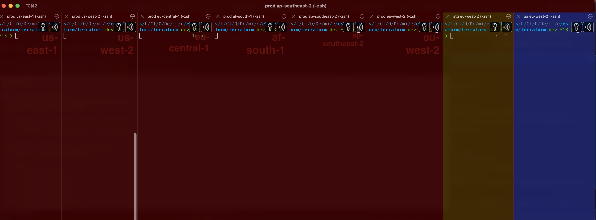

## Usage
https://youtu.be/rYSePf9fJio  
These scripts are used together where `./bc-tabs` acts as an entrypoint.  
This allows to save time on running commands in multi-environment setup by running them simultaneously, while saves you from messing up tabs/environments (applying things to a wrong target).

This feels like ansible ad-hoc commands but with enhanced user experience because you can toggle broadcast input, view fresh logs in related tabs.

## Installation
Add `./bc-tabs`, `./safe-ops`, `./update-kubeconfigs` script to your PATH. 

Configure environments and regions in these scrtips. There is no shared config yet.

## bc-tabs

Creates iterm2 tabs per environment and region.  
Press `command+option+I` to toggle broadcast input. Run commands without hardcoded env and region:
```
terraform init  -backend-config environments/${ENVIRONMENT}/${AWS_REGION}/backend.tfvars
terraform apply -var-file environments/${ENVIRONMENT}/${AWS_REGION}/variables.tfvars
```
This works perfectly well because `./safe-ops` does `export TF_DATA_DIR=".terraform_${ENVIRONMENT}_${REGION}"`


## safe-ops
Motivation: https://medium.com/@maximonyshchenko/how-not-accidentally-wipe-out-prod-6249f0e2aa5b

Add these lines to your `~/.zshrc` or `~/.bashrc`  :
```bash
tput reset # this is to reset terminal sessions / related to  safe-ops script usage
echo -e "\033]1337;SetBadgeFormat=\a" # This is to set clear iTerm2 badgee  / related to  safe-ops script usage
```


## update-kubeconfigs
Creates a kubeconfig per cluster so you can switch clusters with `KUBECONFIG` env var, not context. The problem with context is that you can not use different clusters in different tabs.  

